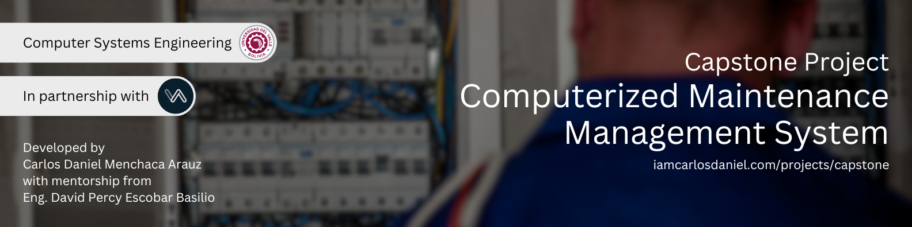

# Capstone Project - CMMS



Mi propósito con este proyecto, plasmado en este repositorio, es compartir lo que he aprendido en el camino del desarrollo de software y la arquitectura de sistemas, con la esperanza de ser una guía para quienes están dando sus primeros pasos en el mundo del software. Confío en que el contenido aquí compartido no solo les sea útil, sino que también los motive a seguir aprendiendo, explorando y creciendo como profesionales. Que este proyecto sea un pequeño impulso en el inicio de un gran camino.

> [!IMPORTANT]
> Este proyecto fue desarrollado como parte del trabajo de grado de la carrera de Ingeniería de Sistemas Informáticos de la Universidad del Valle (UNIVALLE), sede Santa Cruz, en colaboración con la empresa ELETEC, bajo la tutoría del Ing. David Percy Escobar Basilio.

## Instalación


1. Clona el repositorio en tu máquina local:

   ```bash
   git clone https://github.com/iamcarlosdaniel/capstone-cmms-server-api-microservices
   ```

2. Navega al directorio del proyecto:

   ```bash
   cd capstone-cmms-server-api-microservices
   ```

3. Construir la imagen docker:

   ```bash
   docker build -t api-gateway-image .
   ```

4. Correr el contenedor:

   ```bash
   docker run -d -p 8080:80 --name api-gateway-container api-gateway-image
   ```

5. Acceder a la aplicación:

   ```bash
   http://localhost:8080
   ```

## Agradecimientos

Agradezco al **Ing. David Percy Escobar Basilio** por su valiosa orientación, asesoría técnica y constante apoyo a lo largo del desarrollo de este proyecto.

Agradezco al CEO de ELETEC, **Gustavo Adolfo Menchaca Moreira**, por su disposición y colaboración al brindarnos acceso a la información clave sobre los flujos de trabajo internos de la empresa.

## Licencia

Este proyecto está licenciado bajo los términos de la [GNU Affero General Public License v3.0](LICENSE).
